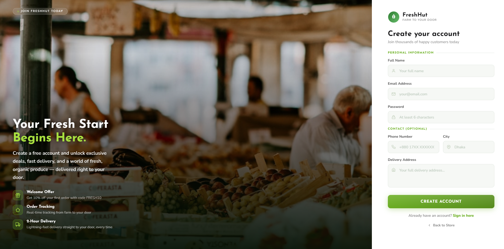
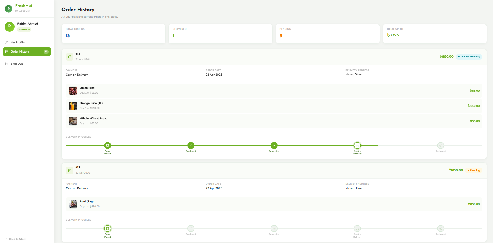
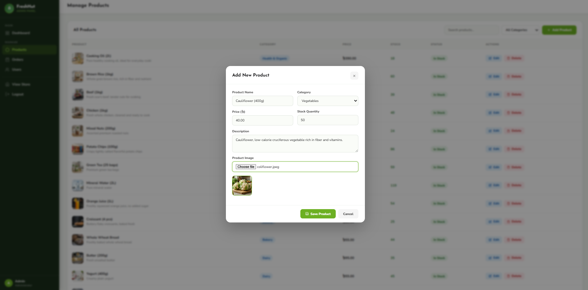

<div align="center">
  
</div>

<h1 align="center">🛒 FreshHut — Online Grocery Store</h1>
<p align="center"><i>Farm to Your Door — a full-stack grocery shopping platform built with PHP, MySQL, JavaScript &amp; HTML/CSS</i></p>

<p align="center">
  
  
  
  
  
</p>

## Table of Contents

- [Live Demo](#live-demo)
- [Overview](#overview)
- [Features](#features)
- [Screenshots](#screenshots)
- [Tech Stack](#tech-stack)
- [Project Structure](#project-structure)
- [Database Schema](#database-schema)
- [Getting Started](#getting-started)
- [Environment Variables](#environment-variables)
- [Demo Accounts](#demo-accounts)
- [Team](#team)

<h2 id="live-demo" align="center">Live Demo</h2>

<div align="center">
  <a href="https://freshhut-grocery.onrender.com/">
    
  </a>
</div>

> ⏳ Hosted on Render's free tier — the server sleeps when idle, so the first load after inactivity can take 30–50 seconds to spin up.

## Overview

FreshHut is a web-based online grocery store built as a mini project for the Department of Computer Science & Engineering. It gives customers a complete shopping experience — browsing products by category, managing a cart, checking out with a choice of payment methods, and tracking orders in real time — while giving administrators a full panel to manage products, orders, and users.

The frontend is built with plain HTML, CSS, and vanilla JavaScript (no frameworks), and talks to a PHP REST-style API backed by a MySQL database. The whole thing is containerized with Docker and deployed on Render, with the database hosted on Aiven.

## Features

**For Customers**
- 🔐 Registration & login with PHP session-based authentication
- 🛍️ Product catalog with category filters, live search, and a featured products section
- 🛒 Shopping cart with quantity controls and stock validation
- 💳 Checkout with 4 payment options — Cash on Delivery, bKash, Nagad, Rocket
- 📦 Real-time order tracking with a visual status timeline (`Pending → Confirmed → Processing → Out for Delivery → Delivered`)
- 👤 Profile panel to update personal info and view order history

**For Admins**
- 📊 Dashboard with total orders, revenue, product count, and low-stock alerts
- 🥕 Product management — add, edit, delete products with image uploads
- 📋 Order management — view full order details and update status
- 👥 User management — view customers, change roles, delete accounts

## Screenshots

<table>
  <tr>
    <td align="center"><b>Create Account</b><br></td>
    <td align="center"><b>Shopping Cart</b><br></td>
  </tr>
  <tr>
    <td align="center"><b>Order Tracking</b><br></td>
    <td align="center"><b>Admin Dashboard</b><br></td>
  </tr>
  <tr>
    <td align="center" colspan="2"><b>Admin — Manage Products</b><br></td>
  </tr>
</table>

## Tech Stack

| Layer | Technology |
|---|---|
| Frontend | HTML5, CSS3, Vanilla JavaScript (Fetch API) |
| Backend | PHP 8.2 (procedural REST-style API) |
| Database | MySQL (hosted on Aiven, SSL-secured connection) |
| Auth | PHP sessions + hashed passwords, with "remember me" via secure tokens |
| Web Server | Apache (via `php:8.2-apache` Docker image) |
| Deployment | Docker container on Render |

## Project Structure

```
Grocery-Store1/
├── api/                  # PHP backend endpoints (auth, products, cart, orders, users)
├── admin/                # Admin panel (dashboard, products, orders, users)
├── user/                 # Customer profile panel
├── config/               # Database connection + auto setup, SSL cert
├── css/                  # Stylesheets
├── js/                   # Frontend logic (main, auth, cart, checkout, admin)
├── uploads/products/     # Uploaded product images
├── index.html            # Homepage
├── products.html         # Product catalog & search
├── cart.html / checkout.html
├── tracking.html         # Order tracking / history
├── login.html / register.html
├── Dockerfile
└── entrypoint.sh
```

## Database Schema

The schema is created and seeded automatically on first run (see `config/db.php`) — no manual SQL import needed.

- **users** — customers & admins, with hashed passwords and roles
- **categories** — 8 product categories (Vegetables, Fruits, Dairy, Bakery, Beverages, Snacks, Meats, Health & Organic)
- **products** — 24 seeded products linked to categories
- **cart** — per-user cart items
- **orders** — order records with status, payment method, and delivery address
- **order_items** — line items for each order

Foreign keys enforce relational integrity across cart, orders, and order_items.

## Getting Started

### Prerequisites
- PHP 8.2+ with the `pdo_mysql` extension, or Docker
- A MySQL database (local via XAMPP, or a hosted instance like Aiven)

### Option A — Run with Docker
```bash
git clone <this-repo-url>
cd Grocery-Store1
docker build -t freshhut .
docker run -p 8080:10000 \
  -e DB_HOST=your_db_host -e DB_USER=your_db_user \
  -e DB_PASS=your_db_pass -e DB_NAME=your_db_name -e DB_PORT=3306 \
  freshhut
```
Visit `http://localhost:8080`.

### Option B — Run with XAMPP
1. Copy the `Grocery-Store1` folder into `htdocs/`
2. Start Apache & MySQL from the XAMPP control panel
3. Set your local DB credentials as environment variables, or edit the fallback values in `config/db.php`
4. Visit `http://localhost/Grocery-Store1/`

Tables and seed data (admin user, sample customer, categories, products) are created automatically on the first request.

## Environment Variables

| Variable | Description |
|---|---|
| `DB_HOST` | MySQL host |
| `DB_USER` | MySQL username |
| `DB_PASS` | MySQL password |
| `DB_NAME` | Database name |
| `DB_PORT` | MySQL port |
| `PORT` | Port Apache listens on (set automatically by Render) |

## Demo Accounts

The live demo comes pre-seeded with these accounts so you can try both roles right away:

| Role | Email | Password |
|---|---|---|
| Admin | `admin@freshhut.com` | `FreshHut_Admin_2026!` |
| Customer | `customer@test.com` | `customer123` |

## Team

Built for the "Mini Project: Online Grocery Store" coursework, Department of Computer Science & Engineering.

| Name | ID |
|---|---|
| Md. Imam Hasan | 2023-1-60-030 |
| Md. Abdulla Hasan | 2023-1-60-034 |
| Tabassum Talukder | 2023-1-60-039 |

Supervised by **Nahid Hasan**, Lecturer, Dept. of CSE.

---

<p align="center">Made with 🥦 by the FreshHut team</p>
 
